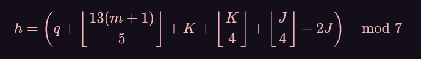

# Algoritmo de Zeller
Para que serve?
---
É um Algoritmo usado para descobrir o *dia da semana* com base na data, tem como formula: 



Onde:
```
q = dia
m = mês
K = ano do século (ano mod 100)
J = século (ano div 100)
```